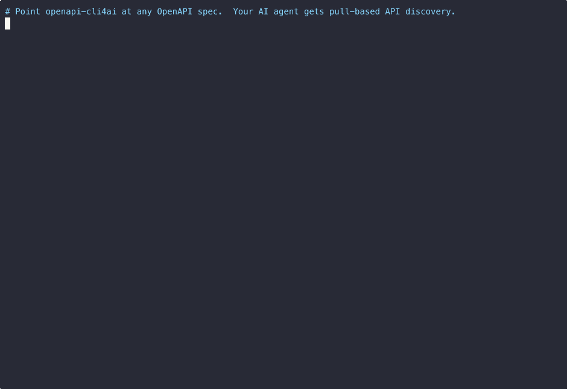

```bash
                                     _            _ _ _  _         _
   ___  _ __   ___ _ __   __ _ _ __ (_)       ___| (_) || |   __ _(_)
  / _ \| '_ \ / _ \ '_ \ / _` | '_ \| |_____ / __| | | || |_ / _` | |
 | (_) | |_) |  __/ | | | (_| | |_) | |_____| (__| | |__   _| (_| | |
  \___/| .__/ \___|_| |_|\__,_| .__/|_|      \___|_|_|  |_|  \__,_|_|
       |_|                    |_|
```

Turn any REST API with an OpenAPI spec into an AI-ready CLI. No MCP server. No custom integration. Just point it at a URL.



## Install

```bash
# Requires uv (https://docs.astral.sh/uv/)
uv pip install openapi-cli4ai

# Or run directly without installing
uvx openapi-cli4ai --help
```

## Quick Start

```bash
# Point it at any API with an OpenAPI spec
openapi-cli4ai init petstore --url https://petstore3.swagger.io/api/v3

# Discover endpoints
openapi-cli4ai endpoints

# Search endpoints
openapi-cli4ai endpoints -s pet

# Call an endpoint
openapi-cli4ai call GET /pet/findByStatus --query status=available
```

## How It Works

```
Your AI Agent (Claude, GPT, Cursor, etc.)
        |
        |  1. "endpoints -s users"     <-- discover what's available
        |  2. reads the endpoint list
        |  3. "call GET /users/123"    <-- makes the API call
        |
        v
+---------------------+         +----------------------+
|   openapi-cli4ai    |-------->|   Your API Server    |
|                     |         |   (any REST API)     |
|  * Fetches spec     |<--------|                      |
|  * Caches it        |         +----------------------+
|  * Routes calls     |
|  * Handles auth     |
+---------------------+
```

The agent uses `endpoints` to discover what's available, then `call` to hit the right endpoint with the right parameters. That's the entire integration. The agent already knows how to use a CLI — you just give it this one and point it at your API.

## Why Not MCP?

Every MCP tool you connect injects its schema into the prompt. Every parameter, every description, every type definition. Connect a few MCP servers and your agent is burning tokens on tool descriptions before it even starts thinking about your task.

For large API surfaces, there's a better pattern: **pull-based discovery**.

Nothing is injected into the prompt upfront. The agent pulls what it needs, when it needs it. It sees a compact endpoint index, picks the right endpoint, and calls it. This works with APIs of any size — including 10MB+ specs — without stuffing everything into context.

This isn't MCP vs. OpenAPI. It's about having both tools and reaching for the right one. For quick integrations, MCP is great. For large or unfamiliar API surfaces, an OpenAPI spec and a thin CLI is the better play.

## Commands

### `init` — Point it at an API

```bash
# Auto-detect OpenAPI spec location
openapi-cli4ai init myapi --url https://api.example.com

# Specify spec path
openapi-cli4ai init myapi --url https://api.example.com --spec /v2/openapi.json

# Specify auth type
openapi-cli4ai init myapi --url https://api.example.com --auth bearer

# Use a remote spec URL
openapi-cli4ai init myapi --url https://api.example.com --spec-url https://example.com/spec.json

# Skip SSL verification (internal/staging APIs)
openapi-cli4ai -k init myapi --url https://staging.internal.example.com
```

### `endpoints` — Discover API endpoints

```bash
# List all endpoints
openapi-cli4ai endpoints

# Search by keyword
openapi-cli4ai endpoints -s pet

# Filter by tag
openapi-cli4ai endpoints --tag store

# Output as JSON (useful for AI agents)
openapi-cli4ai endpoints --format json

# Compact one-line-per-endpoint view
openapi-cli4ai endpoints --format compact
```

### `call` — Call any endpoint

```bash
# GET request
openapi-cli4ai call GET /pet/findByStatus --query status=available

# POST with JSON body
openapi-cli4ai call POST /pet --body '{"name": "Rex", "status": "available"}'

# POST with body from file
openapi-cli4ai call POST /pet --body @payload.json

# Multiple query parameters
openapi-cli4ai call GET /pet/findByStatus --query status=available --query limit=10

# Custom headers
openapi-cli4ai call GET /resource --header "X-Custom:value"

# Stream SSE responses
openapi-cli4ai call POST /chat --body '{"message": "hello"}' --stream

# Raw output (no formatting)
openapi-cli4ai call GET /pet/1 --raw
```

### `profile` — Manage API profiles

```bash
# List profiles
openapi-cli4ai profile list

# Switch active profile
openapi-cli4ai profile use myapi

# Show profile config
openapi-cli4ai profile show

# Add a profile manually
openapi-cli4ai profile add myapi --url https://api.example.com

# Remove a profile
openapi-cli4ai profile remove myapi
```

### `login` / `logout` — Authentication

```bash
# Login (for APIs with OAuth/token endpoints)
openapi-cli4ai login --username admin

# Login with password from file (for automation)
openapi-cli4ai login --username admin --password-file /path/to/secret

# Login with password from stdin
echo "my-password" | openapi-cli4ai login --username admin --password-stdin

# Logout (clear cached tokens)
openapi-cli4ai logout
```

## Configuration

Profiles are stored in `~/.openapi-cli4ai.toml`. Secrets are referenced via environment variables — never stored in the config file.

```toml
active_profile = "myapi"

[profiles.myapi]
base_url = "https://api.example.com"
openapi_path = "/openapi.json"

[profiles.myapi.auth]
type = "bearer"
token_env_var = "MYAPI_TOKEN"

[profiles.stripe]
base_url = "https://api.stripe.com"
openapi_url = "https://raw.githubusercontent.com/stripe/openapi/master/openapi/spec3.json"

[profiles.stripe.auth]
type = "api-key"
env_var = "STRIPE_SECRET_KEY"
header = "Authorization"
prefix = "Bearer "

[profiles.internal-app]
base_url = "http://localhost:8000"
verify_ssl = false

[profiles.internal-app.auth]
type = "bearer"
token_endpoint = "/api/auth/token"
refresh_endpoint = "/api/auth/refresh"

[profiles.internal-app.auth.payload]
username = "{username}"
password = "{password}"
tenant = "{env:MY_TENANT}"
account_type = "USERNAME"
```

Payload placeholders: `{username}` and `{password}` come from the login prompt. `{env:VAR_NAME}` pulls from environment variables or a `.env` file (loaded automatically).

### Auth Types

| Type | Use Case | Config Fields |
|------|----------|---------------|
| `none` | Public APIs | — |
| `bearer` | Token from env var | `token_env_var` |
| `bearer` | OAuth token endpoint | `token_endpoint`, `refresh_endpoint`, `payload` |
| `api-key` | API key in header | `env_var`, `header`, `prefix` |
| `basic` | HTTP Basic auth | `username_env_var`, `password_env_var` |

## Tested With

| API | Endpoints | Auth | Example |
|-----|-----------|------|---------|
| [Petstore](https://petstore3.swagger.io) | 19 | None | `init petstore --url https://petstore3.swagger.io/api/v3` |
| [NWS Weather](https://api.weather.gov) | 60 | None | `init nws --url https://api.weather.gov` |
| [PokéAPI](https://pokeapi.co) | 97 | None | `init pokeapi --url https://pokeapi.co --spec-url ...` |
| [D&D 5e](https://www.dnd5eapi.co) | 47 | None | `init dnd --url https://www.dnd5eapi.co --spec-url ...` |
| [Nager.Date Holidays](https://date.nager.at) | 8 | None | `init holidays --url https://date.nager.at --spec /openapi/v3.json` |
| [GitHub](https://api.github.com) | 1,080 | Bearer | `init github --url https://api.github.com --spec-url ... --auth bearer` |
| [Jira Cloud](https://developer.atlassian.com/cloud/jira/platform/rest/v3/) | 581 | Basic | `init jira --url https://your-domain.atlassian.net --spec-url ... --auth basic` |
| [OpenRouter](https://openrouter.ai) | 36 | Bearer | `init openrouter --url https://openrouter.ai/api/v1 --spec-url ... --auth bearer` |
| [DBGorilla](https://dbgorilla.com) | 500+ | Token endpoint | See `examples/profiles.toml.example` |

Works with any AI agent that has shell access — Claude Code, Cursor, GitHub Copilot, or anything that can run `endpoints` and `call`.

### Claude Code Setup

Add this to your global `~/.claude/CLAUDE.md` so every Claude Code session knows about the tool — regardless of which repo you're working in:

```markdown
## API Access

You have `openapi-cli4ai` installed for interacting with REST APIs.

- Discover endpoints: `openapi-cli4ai endpoints -s <keyword>`
- Call endpoints: `openapi-cli4ai call <METHOD> <path> [--query key=value] [--body '{}']`
- List profiles: `openapi-cli4ai profile list`
- Switch profile: `openapi-cli4ai profile use <name>`
- Login (if needed): `openapi-cli4ai login`

Use `openapi-cli4ai endpoints` to explore before making calls.
Use `--format json` when you need to parse the output programmatically.
Use `-k` flag for APIs with self-signed or internal certificates.
```

This works because `~/.claude/CLAUDE.md` is loaded into every conversation context, not just the current repo.

## Development

```bash
git clone https://github.com/dbgorilla/openapi-cli4ai.git
cd openapi-cli4ai
uv pip install -e .
pytest tests/ -m "not integration" -v
```

## Security

- All credentials stay local — profiles reference env var names, not values
- Token cache protected with restricted file permissions (0600)
- PyPI releases use [Trusted Publishers](https://docs.pypi.org/trusted-publishers/) with Sigstore attestation
- All CI actions pinned to commit SHAs
- Dependabot monitors dependencies weekly
- See [SECURITY.md](SECURITY.md) for vulnerability reporting

## Attribution

This project was inspired by [@tomleavy](https://github.com/tomleavy), who originated the idea that an OpenAPI spec and a thin CLI is all an AI agent needs to talk to any API.

## License

MIT — see [LICENSE](LICENSE).
